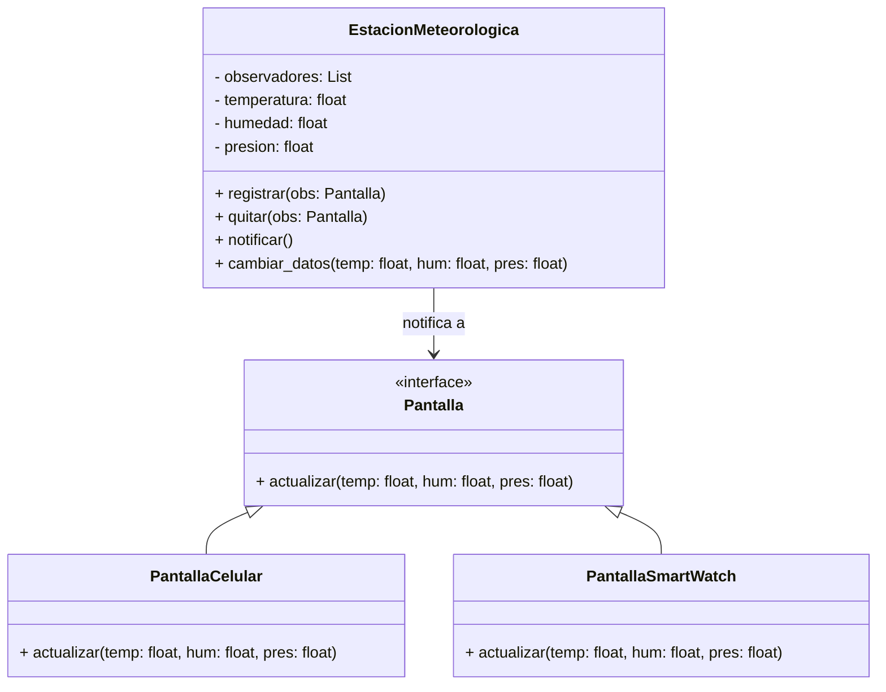
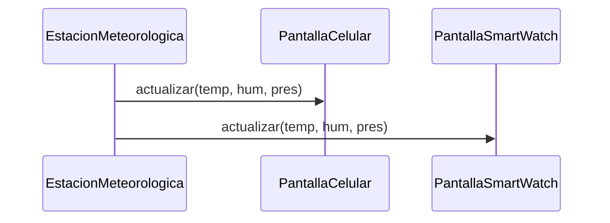

## 🛰️ Patrón Observer – Estación Meteorológica

Se implementa el patrón de diseño **Observer** aplicándolo a una Estación Meteorológica. La clase `EstacionMeteorologica` actúa como **Sujeto**, notificando a múltiples observadores (`PantallaCelular`, `PantallaReloj`) cuando cambian los datos de temperatura, humedad y presión.

### 📐 Diagrama de Clases (Mermaid)

### 📐 Diagrama de Secuencia (Mermaid)

