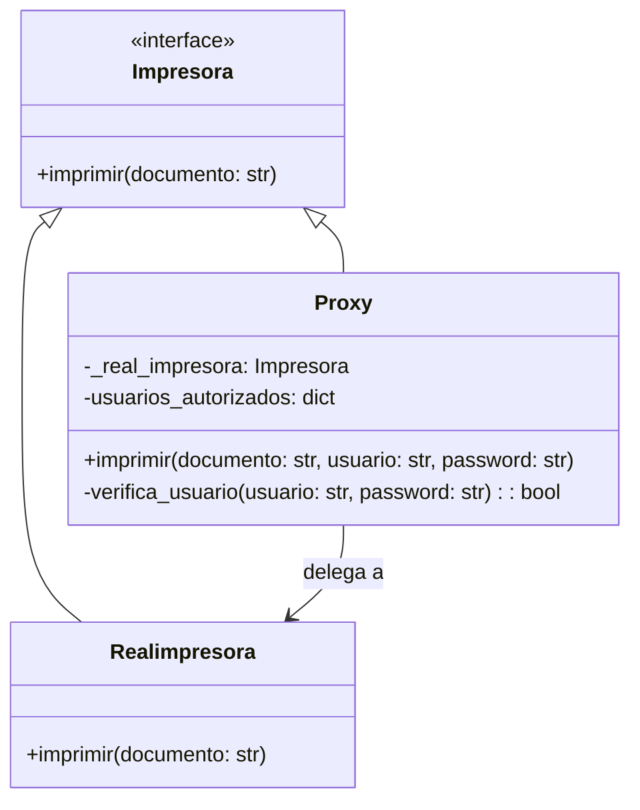
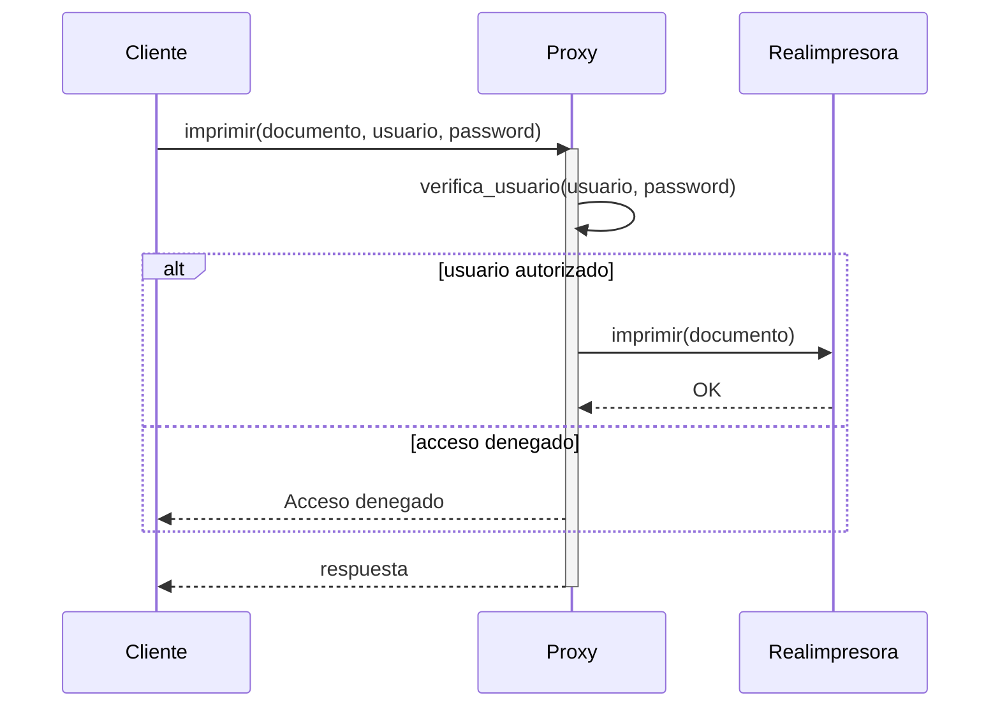

🖨️ Patrón Proxy – Control de Acceso a Impresora

Se implementa el patrón de diseño Proxy para controlar el acceso a una impresora.
La clase Proxy actúa como intermediaria entre el usuario y la impresora real, verificando las credenciales antes de permitir la impresión.

### 📐 Diagrama de Clases (Mermaid)

### 📐 Diagrama de Secuencia (Mermaid)

